# 👋 Hi, I'm Cem Başar Ceylani  

🎓 **Computer Engineering Graduate** from Izmir University of Economics  
🌍 Erasmus Exchange Student at **THWS University, Germany**  
💻 Interested in **Backend Development**, **Full-Stack Development**, **Cloud Deployment**, **Mobile Development**, and **Game Development**

🌐 Portfolio:  
https://cembc.github.io/CemBasarCeylani

---

## 🛠 Tech Stack

  <!-- Programming Languages -->
  
  
  
  
  
  

  <!-- Web -->
  
  
  
  

  <!-- Backend -->
  
  
  
  
  
  

  <!-- Databases -->
  
  

  <!-- Cloud / DevOps -->
  
  
  

  <!-- Mobile & Game Development -->
  
  
  

  <!-- Tools / Libraries -->
  
  
  

---

## 📂 Featured Projects

- **Library Management API** - ASP.NET Core REST API for a library management system featuring JWT authentication, role-based authorization, Entity Framework Core, SQL Server, FluentValidation, AutoMapper, Azure Blob Storage, testing, Docker, CI/CD with GitHub Actions, and Azure deployment. [Repository](https://github.com/CemBC/AspNetCore-LibraryApi-V1)

- **Library Management Frontend** - React and TypeScript frontend for the Library Management System featuring member/admin interfaces, authentication, role-based routing, book browsing, loan management, search, filtering, pagination, image uploads, and API health monitoring. [Repository](https://github.com/CemBC/LibraryManagement-website) | [Live Website](https://cembc.github.io/LibraryManagement-website/)

- **Reservation API** - Node.js and Express REST API using PostgreSQL and Prisma, featuring JWT authentication, role-based authorization, reservation conflict handling, validation, global error handling, Swagger documentation, testing, and Azure deployment. [Repository](https://github.com/CemBC/ReservationApi)
---

### 🎮 Mobile Games — Unity

- **Cow Escape** — 3D platform runner game with obstacle mechanics.
- **Fill It Up** — 2D UI puzzle game involving volume logic and precision pouring.
- **Cake Slicer** — Physics-based slicing challenge with accuracy scoring.
- **Another TD Game** — Tower defense game featuring strategic tower placement, enemy waves, and optimized projectile systems.
- **Chick Game** — Desktop Unity project developed while learning the fundamentals of Unity.

---

### 💻 Other Projects

- **Card Games on CLI** — Slapjack and a custom variant developed in Java.
- **Integrated Assignment Environment** — Environment for evaluating and comparing coding assignments. [IAE Repository](https://github.com/Serhatt2/Ce316_Project)
- **SwiftUI & Flutter Applications** — Various mobile application projects.
- **Computer Vision Projects** — Projects using OpenCV and related technologies.

More projects are available on my [GitHub profile](https://github.com/CemBC).

---

  

    

  

  

    

  

---

## 📫 Connect With Me

  
  

---
